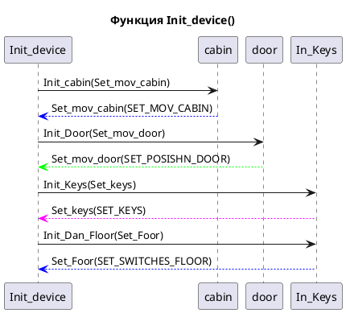

# My descript text

# My descript text2

```puml
@startuml Init_device
title "Функция Init_device()"
    Init_device -> cabin : Init_cabin(Set_mov_cabin)
    cabin  -[#0000FF]-> Init_device : Set_mov_cabin(SET_MOV_CABIN)

    Init_device -> door : Init_Door(Set_mov_door)
    door -[#00FF00]-> Init_device : Set_mov_door(SET_POSISHN_DOOR)

    Init_device -> In_Keys : Init_Keys(Set_keys)
    In_Keys -[#FF00FF]->Init_device : Set_keys(SET_KEYS)

    Init_device -> In_Keys : Init_Dan_Floor(Set_Foor)
    In_Keys -[#0000FF]-> Init_device : Set_Foor(SET_SWITCHES_FLOOR)
@enduml
```

# My descript text3

