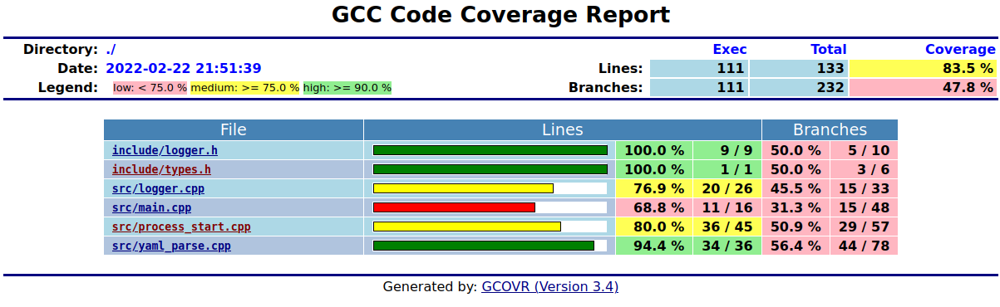
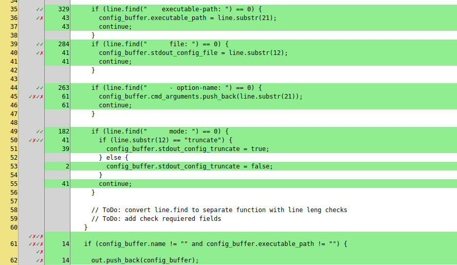

# unit tests
Back to [README.md](../README.md)

## Description:
For unit testing was choised gtest framework.
Google Test (also known as gtest) is a unit testing library for the C++ programming language, based on the xUnit architecture.

## Syntax:
To run all tests you need to:
```
cd build
cmake ../
make
./tests
```

To view list of tests name:
```
./tests --gtest_list_tests
```

To run specific test:
```
./tests  --gtest_filter=Test_Cases1* 
```

## Returns:
Example output to console:


## Check Code Coverage - GCOV
Gcov is a source code coverage analysis and statement-by-statement profiling tool. Gcov generates exact counts of the number of times each statement in a program is executed and annotates source code to add instrumentation.

1. Requirements:
* gcovr to form report
```
$ sudo apt install gcovr
```
2. Run:
* Build cmake in "build" folder
```
$ mkdir build
$ cd build
$ cmake ../
```
* Make code coverage target
```
$ make code_coverage
```

## Example
 
 
